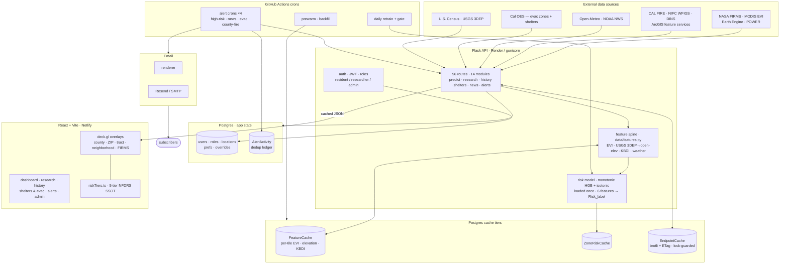
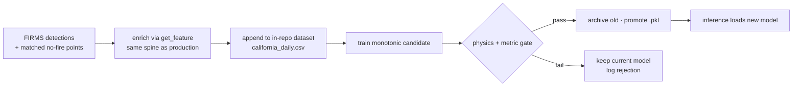

<div align="center">

# FireScope

**See California wildfire risk before it's news.** An interactive platform that fuses satellite, fire-agency, weather, and evacuation feeds into one live map — with a physically-correct risk model and four opt-in email alert channels.

[**Live site → firescope.dev**](https://firescope.dev) · [Architecture](docs/ARCHITECTURE.md) · [Changelog](CHANGELOG.md) · [Contributing](CONTRIBUTING.md)

    

</div>

---

FireScope aggregates open-source wildfire data from government agencies, satellite systems, and news
providers into a single interactive dashboard for California — risk zones, live and historical fire
perimeters, evacuation orders, and emergency shelters on one deck.gl map. A machine-learning model
scores wildfire risk from six live environmental features, and four opt-in email channels notify users
when the situation around their saved locations actually changes.

In the app you can:

- **Read risk at a glance** — county / ZIP / census-tract / neighborhood risk zones on a 5-tier NFDRS
  scale, beside a live active-fire perimeter map with containment coloring.
- **Probe the model** — on the Research page, drag sliders for any zone (EVI, temperature, wind,
  humidity, elevation, KBDI) and watch the risk recompute; save a zone's snapshot for 24 hours.
- **Look back** — 22,000+ CAL FIRE perimeters to 1878, with per-year CAL FIRE DINS structure-damage
  overlays so a 0-structure wildland burn reads differently from an urban-interface catastrophe.
- **Find safety** — 8,014 pre-staged California shelters with click-to-route, plus live statewide
  evacuation orders and warnings (the same Cal OES source Watch Duty consumes).
- **Get alerted** — opt into high-risk-zone, breaking-news, evacuation, or wildfire-in-your-county
  emails; state-driven dedup means you're only re-emailed when something changes.

## Live site

**[firescope.dev](https://firescope.dev)** (custom domain) · [firescope.netlify.app](https://firescope.netlify.app)
· API at [`firescope-api.onrender.com/api`](https://firescope-api.onrender.com/api).

Senior research project at **California State University, Northridge** (ARCS, 2025–2026).

## Features

| Surface | What it does |
|---|---|
| **Dashboard** | Split view — risk-zone map (county / ZIP / tract / neighborhood) + active-fire perimeter map with 4-tier containment coloring and a live active-fire count. |
| **Research page** | Per-zone slider overrides (EVI, temp, wind, humidity, elevation, **KBDI** 0–800) with live risk recompute; save a zone for 24h; 20-zone shared cap; researcher shelter overlay. |
| **History** | 22k+ CAL FIRE perimeters back to 1878, year + fire search, decoded CAUSE codes, and per-year **DINS structure-damage** (2013→present) with Destroyed/Major/Minor/Affected breakdowns. |
| **Shelters & Evacuation** | 8,014 CA shelters (CalOES mirror) with in-map routing + Open-in-Google-Maps; live Cal OES evacuation **orders / warnings / advisories / shelter-in-place**; 60s auto-refresh. |
| **Alerts** | Per-user master switch + four channel toggles (high-risk zones / breaking news / evacuation / wildfire-in-your-county); RFC 8058 one-click unsubscribe. |
| **Admin** | User management, refresh schedules, model configuration. |

## User roles

FireScope has three account roles (seeded as `Resident`, `Researcher`, `Admin` in
`backend/seed.py`), enforced server-side — not just hidden in the UI.

| Role | Who they are | What they can do |
|---|---|---|
| **Public** (`Resident`) | The default role for anyone who signs up | Dashboard, history, shelters & evacuation, and active-fire views; save locations; opt into all four email alert channels (high-risk zones, breaking news, evacuation, wildfire-in-your-county) |
| **Researcher** | A user granted access via an **admin-approved in-app role request** | Everything a public user can, **plus the Research page** — per-zone slider overrides with live risk recompute, FIRMS hotspots, the risk grid, and the 8,014-shelter overlay (`/api/research/fire-data` and `/api/research/risk-grid` are gated to Researcher + Admin) |
| **Admin** | Seeded administrators and promoted users | Everything, **plus** user management, approving/denying role requests, model configuration, manual alert triggers and digests, and platform stats (every `/api/admin/*` route is `require_admin`) |

A signed-in user requests Researcher access from the Research page; an admin approves it from the
admin console (the `role_requests` table tracks pending/approved/denied).

## Risk model

A **physically-correct monotonic model** predicting wildfire risk from six live features:

`HistGradientBoostingClassifier` with monotonic constraints `[0,1,1,-1,0,1]` over
`[evi, air_temp_encoded, wind, humidity, elevation, kbdi]` (temperature / wind / KBDI increasing,
humidity decreasing; EVI / elevation free), isotonic-calibrated. A **PDP physical-direction gate**
rejects any candidate whose constrained features point the wrong way — so the shipped model can't
learn the backwards relationships the prior calibrated model did (wind anti-correlated, humidity
inverted, KBDI saturating).

| Feature | Source |
|---|---|
| `evi` | MODIS MOD13Q1 Enhanced Vegetation Index (Google Earth Engine, USGS-backed IDW fallback) |
| `air_temp_encoded` | `(°C + 273.15) / 0.02` — displayed as °F in the UI |
| `wind` | Wind speed (m/s, Open-Meteo) |
| `humidity` | Relative humidity (%) |
| `elevation` | USGS 3DEP |
| `kbdi` | Keetch-Byram Drought Index — 30-day cumulative soil-moisture deficit |

The model **loads once at startup** and is retrained daily by a **GitHub-Actions pipeline** that
ingests FIRMS detections, appends to an in-repo dataset (zero DB cost-risk), runs a physics-hard +
metric gate, and promotes on pass. Details in [`backend/ml/README.md`](backend/ml/README.md) and
[docs/ARCHITECTURE.md](docs/ARCHITECTURE.md).

## Data sources

- **Satellite** — NASA FIRMS (VIIRS SNPP), NASA ORNL DAAC MODIS MOD13Q1 (EVI)
- **Fire agencies** — CAL FIRE Incidents & Historic Perimeters, NIFC WFIGS, CAL FIRE DINS damage
  (132,000+ structures, 2013→present)
- **Emergency management** — Cal OES `CA_EVACUATIONS_PROD` (Genasys PROTECT + county feeds),
  CalOES shelter mirror (8,014 facilities)
- **Weather & news** — Open-Meteo + NASA POWER (weather), NOAA NWS ATOM feed, GNews + Google
  Programmable Search (wildfire news)
- **Boundaries** — U.S. Census TIGER/Line (58 counties · 1,769 ZIPs · 8,041 tracts · 1,521 neighborhoods)
- **Mapping** — Google Maps Platform, deck.gl v9

The in-app **Settings → About** page lists every source with badges.

## Architecture

A dozen open feeds are proxied by a **Flask API of 56 routes across 14 modules**, scored by a
monotonic risk model loaded once at startup, and served through a **three-tier Postgres cache** —
per-tile `FeatureCache` (EVI / elevation / KBDI) → `ZoneRiskCache` → lock-guarded, brotli-compressed
`EndpointCache` — to a **React + deck.gl** frontend. A single feature spine
(`data/features.py:get_feature`, with USGS 3DEP falling back to open-elevation) computes the inputs
for **both** live inference and the retrain ingest, so the model trains on exactly the features
production serves. Everything time-based — four alert channels, the daily retrain, cache
pre-warming — runs as **GitHub-Actions crons**, so there is no always-on worker. Roles
(user / researcher / admin) gate the API; alert dedup is ledgered in `AlertActivity` so users are
only re-emailed when the situation changes.



**Continuous retraining** runs entirely in GitHub — the dataset is committed in-repo (zero DB
cost-risk) and a candidate only ships if it survives a physics-direction gate:



Full component breakdown, request lifecycle, and deploy topology in [docs/ARCHITECTURE.md](docs/ARCHITECTURE.md).

## Getting started

### Option 1 — Docker (recommended)

Requires [Docker Desktop](https://www.docker.com/products/docker-desktop/).

```bash
cp .env.example .env        # fill DB creds, SECRET_KEY, JWT_SECRET_KEY, VITE_GOOGLE_MAPS_API_KEY
docker-compose up --build   # frontend → http://localhost · API → http://localhost:5000/api
```

| Variable | Description |
|---|---|
| `DB_USER` / `DB_PASSWORD` / `DB_NAME` | Postgres credentials |
| `SECRET_KEY` | Flask session secret (long random string) |
| `JWT_SECRET_KEY` | JWT signing secret (a *different* long random string) |
| `INITIAL_ADMIN_EMAIL` / `INITIAL_ADMIN_PASSWORD` | Seeded admin account — change before deploying |
| `VITE_GOOGLE_MAPS_API_KEY` | Google Maps JavaScript API key |

**Never commit `.env`.** It is gitignored. Generate fresh secrets per environment. Subsequent starts:
`docker-compose up`; stop: `docker-compose down`; reset data: `docker-compose down -v`.

### Option 2 — Manual setup

Requirements: Node.js 18+, Python 3.10+ (3.12 in production), PostgreSQL 14+ (or `DATABASE_URL=sqlite:///dev.db`).

```bash
# Backend
cd backend
python3 -m venv .venv && source .venv/bin/activate
pip install -r requirements.txt
cp .env.example .env
flask --app app.py db upgrade && python seed.py
python app.py                 # http://localhost:5000

# Frontend
cd frontend
npm install
cp .env.example .env          # VITE_GOOGLE_MAPS_API_KEY, VITE_API_URL
npm run dev                   # http://localhost:3000
```

## Email alerts

Pick one provider and set the matching env vars on the host.

**Gmail SMTP** (no domain needed; ~500 recipients/day, may land in Spam while developing):

```env
EMAIL_PROVIDER=smtp
SMTP_HOST=smtp.gmail.com
SMTP_PORT=587
SMTP_USERNAME=your-gmail@gmail.com
SMTP_PASSWORD=<16-char Gmail app password>
SENDER_EMAIL=your-gmail@gmail.com
SENDER_NAME=FireScope Alerts
```

**Resend** (requires a verified domain): `EMAIL_PROVIDER=resend`, `RESEND_API_KEY=re_...`,
`SENDER_EMAIL=alerts@your-domain.com`. Full guide in [`backend/SETUP_EMAIL.md`](backend/SETUP_EMAIL.md).

## Deployment

- **Frontend** → Netlify, built from `domain-deployment` (CI keeps it synced from `main`).
- **Backend** → Render (`firescope-api`), gunicorn on Python 3.12, with a Render-managed Postgres.
- **Push to `main` is the whole deploy** — `sync-domain-deployment.yml` merges `main →
  domain-deployment` (Netlify builds), and backend pushes auto-restart Render via
  `restart-after-backend-deploy.yml`. **Never force-push `domain-deployment`.**

Secrets live only in Netlify/Render environment variables — never in the repo. See
[SECURITY.md](SECURITY.md).

## Project structure

```
frontend/      React + TypeScript + Vite (deck.gl v9, @vis.gl/react-google-maps)
backend/       Flask API
  routes/        auth · predict · research · history · shelters · notifications · admin · internal alerts
  ml/            monotonic risk model, inference, train + retrain-and-gate pipeline
  services/      caching, email render/send
  data/          boundary GeoJSON + live-source adapters
  tests/         pytest suite
migrations/    Alembic database migrations
docs/          ARCHITECTURE.md · SESSION_HANDOFF.md · GIT_WORKFLOW.md
.github/       9 GitHub-Actions workflows (alerts ×4, retrain, prewarm, backfill, restart, sync)
```

## Stack

React · TypeScript · Vite · deck.gl · Google Maps Platform · Flask · gunicorn · SQLAlchemy ·
Alembic · scikit-learn · PostgreSQL · Resend / SMTP · Docker · Render · Netlify · GitHub Actions.

## Documentation

- [Architecture](docs/ARCHITECTURE.md) — system design, data flow, components, deploy topology
- [Session handoff](docs/SESSION_HANDOFF.md) — authoritative working notes + per-release detail
- [Risk model](backend/ml/README.md) · [Backend](backend/README.md) · [Email setup](backend/SETUP_EMAIL.md)
- [Software requirements spec](software-requirements-specification.md)
- [Contributing](CONTRIBUTING.md) · [Security](SECURITY.md) · [Code of Conduct](CODE_OF_CONDUCT.md) · [Changelog](CHANGELOG.md)

## Team

Ido Cohen · Alex Hernandez-Abergo · Ivan Lopez · Tony Song · Sannia Jean

## License

[MIT](LICENSE) © 2025–2026 FireScope Team — CSUN ARCS GeoInfo Visualization
