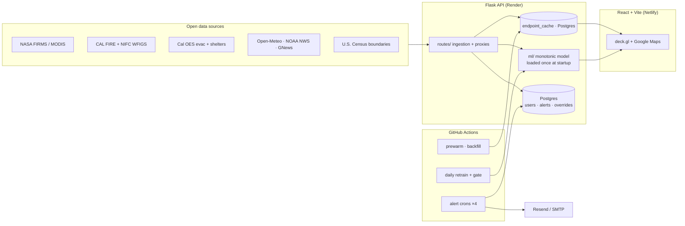

# Architecture

How FireScope turns a dozen open wildfire feeds into an interactive map and four opt-in alert
channels. For release-by-release detail see [SESSION_HANDOFF.md](SESSION_HANDOFF.md); for the model
internals see [`backend/ml/README.md`](../backend/ml/README.md).

## System at a glance

## Components

### Frontend — `frontend/`
React + TypeScript + Vite. The map surface is **deck.gl v9** over **Google Maps**
(`@vis.gl/react-google-maps`). Key invariant: **one `GoogleMapsOverlay` per map** — multiple
overlays stack canvases and block clicks. Risk tiers are a single source of truth in
`src/lib/riskTiers.ts`. The build runs a **typecheck gate** (`scripts/typecheck-gate.cjs`) that fails
on the undefined-reference crash class before `vite build`.

Main views: Dashboard (split risk + active-fire maps), Research page (per-zone slider overrides),
History (22k+ perimeters back to 1878 + DINS structure damage), Shelters & Evacuation, Alerts, Admin.

### Backend — `backend/`
Flask API served by gunicorn. Layout:

| Path | Responsibility |
|---|---|
| `routes/` | Endpoints + upstream proxies: auth, predict, research, history, shelters, notifications, internal alerts, admin |
| `ml/` | The monotonic risk model, inference, training, and the retrain-and-gate pipeline |
| `services/` | Caching, email rendering/sending, shared helpers |
| `models.py` | SQLAlchemy models (users, roles, notification prefs, user overrides, alert activity) |
| `data/` | Boundary GeoJSON and live-source adapters |
| `tests/` | pytest suite |

### Caching — `endpoint_cache`
Public read endpoints are backed by a Postgres `endpoint_cache` table with a 3-tier freshness model
(memory → DB → recompute). Payload shape is `{body, body_br, etag, content_type, computed_at}` and
must be written through the cache helper, never as a raw payload. `computed_at` advances on every
write; a force-recompute backstop logs any row past its freshness window so a multi-day stale-feed
freeze can't recur.

### Risk model — `backend/ml/`
A `HistGradientBoostingClassifier` with monotonic constraints `[0,1,1,-1,0,1]` over
`[evi, air_temp_encoded, wind, humidity, elevation, kbdi]` (temp/wind/kbdi increasing, humidity
decreasing; evi/elevation free), isotonic-calibrated. A **PDP physical-direction gate** rejects any
candidate whose constrained features point the wrong way — physics correctness is enforced, not
assumed. The model loads once at startup via `_ensure_loaded()`; never per-prediction. Air
temperature is Fahrenheit in the UI and Kelvin-encoded (`(°C + 273.15) / 0.02`) in the model —
convert only at the render boundary.

### Scheduled jobs — `.github/workflows/`
GitHub Actions drive everything time-based, so no always-on worker is needed:

| Workflow | Cadence | Job |
|---|---|---|
| `alerts-high-risk.yml` | ~30 min | High-risk zone emails for saved locations |
| `alerts-breaking-news.yml` | ~60 min | NWS Red Flag + wildfire news |
| `alerts-evacuation.yml` | ~10 min | Evac orders + newly-open shelters |
| `alerts-fires.yml` | ~10 min | Per-county active CAL FIRE incident alerts |
| `daily-retrain.yml` | daily | FIRMS ingest → append dataset → gated retrain → promote |
| `daily-prewarm.yml` / `backfill-history.yml` | daily | Warm caches / backfill historical perimeters |
| `restart-after-backend-deploy.yml` | on backend push | Force a real gunicorn restart on Render |
| `sync-domain-deployment.yml` | on push to `main` | Auto-merge `main` → `domain-deployment` |

## Deployment topology

- **Frontend** → Netlify, built from `domain-deployment` (CI keeps it synced from `main`).
- **Backend** → Render (`firescope-api`), gunicorn, Python 3.12, Postgres (Basic-256MB).
- **Push to `main`** is the whole deploy: CI syncs `domain-deployment` → Netlify builds; backend
  pushes auto-restart Render. **Never force-push `domain-deployment`.** After a backend change,
  verify the new behavior is live (the deploy can report "live" while old workers serve stale code).

## Data sources

Satellite (NASA FIRMS VIIRS, MODIS MOD13Q1 EVI) · fire agencies (CAL FIRE incidents + historic
perimeters, NIFC WFIGS, CAL FIRE DINS damage) · emergency management (Cal OES `CA_EVACUATIONS_PROD`,
CalOES shelter mirror, 8,014 facilities) · weather & news (NOAA NWS, Open-Meteo, GNews) · boundaries
(U.S. Census TIGER/Line: 58 counties, 1,769 ZIPs, 8,041 tracts, 1,521 neighborhoods).
