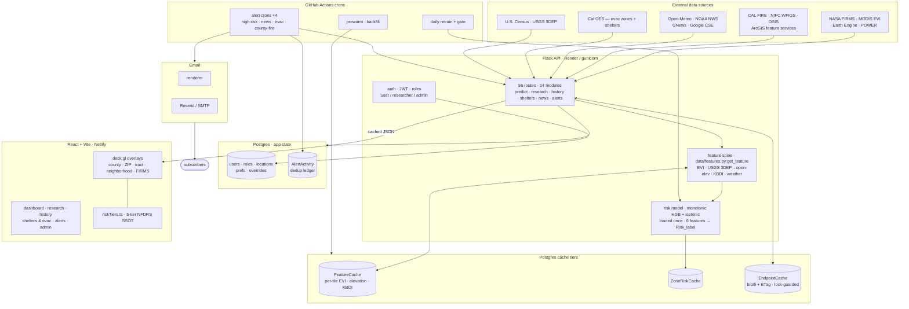
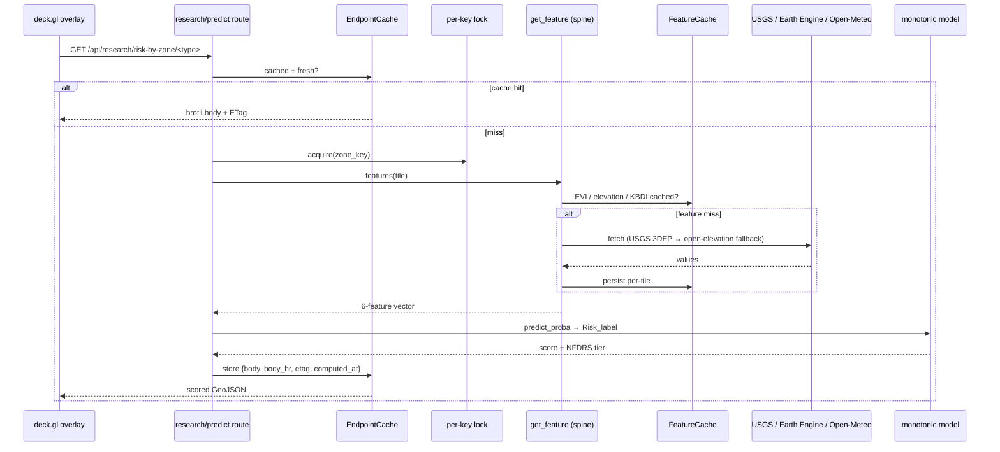
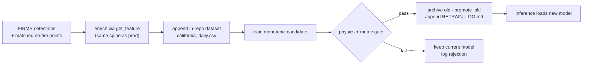

# Architecture

How FireScope turns a dozen open wildfire feeds into an interactive map and four opt-in alert
channels. For release-by-release detail see [SESSION_HANDOFF.md](SESSION_HANDOFF.md); for the model
internals see [`backend/ml/README.md`](../backend/ml/README.md).

> The figures below were audited against the GitNexus code graph (≈2,000 symbols, 56 routes,
> 162 execution flows), not hand-maintained — they reflect what the code actually does.

## System at a glance

## Request lifecycle — a zone-risk read

Grounded in the real `Risk_grid` / `Get_cached_zone_risk` and `Predict_single` call chains: a risk
read is served from cache when warm, and only computes features (hitting the per-tile feature caches,
then upstreams with fallback) on a miss. A per-key lock prevents a cache stampede.

## Components

### Frontend — `frontend/`
React + TypeScript + Vite. The map surface is **deck.gl v9** over **Google Maps**
(`@vis.gl/react-google-maps`). Key invariant: **one `GoogleMapsOverlay` per map** — multiple
overlays stack canvases and block clicks. Risk tiers are a single source of truth in
`src/lib/riskTiers.ts`. The build runs a **typecheck gate** (`scripts/typecheck-gate.cjs`) that fails
on the undefined-reference crash class before `vite build`.

Main views: Dashboard (split risk + active-fire maps), Research page (per-zone slider overrides),
History (22k+ perimeters back to 1878 + DINS structure damage), Shelters & Evacuation, Alerts, Admin.

### Backend — `backend/`
Flask API served by gunicorn — **56 routes across 14 blueprint modules** under `routes/`:

| Module | Routes (examples) |
|---|---|
| `predict.py` | `/predict`, `/predict/batch`, `/predict-custom`, `/fire-perimeters`, `/evacuation-zones`, `/calfire/incidents` |
| `research.py` | `/risk-by-zone/<type>`, `/risk-by-county`, `/risk-grid`, `/boundaries/<name>`, `/fire-data`, `/admin/prewarm-tiles` |
| `history.py` | `/perimeters`, `/perimeters/years`, `/dins`, `/admin/backfill-years` |
| `locations.py` | `/me/locations`, `/me/locations/<id>/risk-by-all-zones` |
| `internal_alerts.py` | `/internal/alerts/{high-risk,breaking-news,evacuation,fires}` (cron-triggered) |
| `alerts.py` | `/monitored-areas`, `/alert-history`, `/admin/alerts/{trigger,digest,send-test}`, `/webhooks/email` |
| `notifications.py` | `/me/notifications`, `/notifications/{subscribe,unsubscribe}`, admin dispatch |
| `ml_ingest.py` | `/internal/ml/ingest` (token-authed retrain feed) |
| `shelters.py` · `news.py` · `overrides.py` | `/shelters`, `/news`, `/overrides` |
| `auth.py` · `me.py` · `admin.py` | `/login`, `/register`, `/me`, `/users`, `/assign-role`, `/stats`, role requests |

Supporting packages: `ml/` (monotonic model, inference, train + retrain-and-gate), `services/`
(`cache`, `email/{provider,renderer,sender,tracker,retry}`, `aggregator`, `scheduler`, `persistence`),
`data/features.py` (the shared feature spine), `models.py` (13 SQLAlchemy models), `tests/` (pytest).

### Caching — three tiers
Risk reads are cached at three levels, innermost first:

1. **`FeatureCache{Evi,Elevation,Kbdi}`** — per-tile environmental inputs, written by the feature
   spine. USGS 3DEP elevation falls back to open-elevation; EVI comes from Earth Engine. This is the
   expensive layer, so it's pre-warmed by `daily-prewarm.yml` and `/admin/prewarm-tiles`.
2. **`ZoneRiskCache`** — scored zone payloads (the model output per zone), so a warm zone skips both
   feature fetch and inference.
3. **`EndpointCache`** — the HTTP response cache: `{body, body_br, etag, content_type, computed_at}`,
   brotli-compressed with ETags, written only through the cache helper and guarded by a per-key lock
   to prevent a stampede. `computed_at` advances on every write; a force-recompute backstop logs any
   row past its freshness window, so the 13-day stale-feed freeze that v3.1 root-caused can't recur.

### Risk model — `backend/ml/`
A `HistGradientBoostingClassifier` with monotonic constraints `[0,1,1,-1,0,1]` over
`[evi, air_temp_encoded, wind, humidity, elevation, kbdi]` (temp/wind/kbdi increasing, humidity
decreasing; evi/elevation free), isotonic-calibrated. A **PDP physical-direction gate** rejects any
candidate whose constrained features point the wrong way — physics correctness is enforced, not
assumed. The model loads once at startup via `_ensure_loaded()`; never per-prediction. Air
temperature is Fahrenheit in the UI and Kelvin-encoded (`(°C + 273.15) / 0.02`) in the model —
convert only at the render boundary.

**Continuous retraining** runs entirely in GitHub Actions — the dataset is committed in-repo (zero DB
cost-risk), the ingest reuses the same `get_feature` spine as production, and a candidate is promoted
only if it survives a physics-direction + metric gate:

### Scheduled jobs — `.github/workflows/`
GitHub Actions drive everything time-based, so no always-on worker is needed:

| Workflow | Cadence | Job |
|---|---|---|
| `alerts-high-risk.yml` | ~30 min | High-risk zone emails for saved locations |
| `alerts-breaking-news.yml` | ~60 min | NWS Red Flag + wildfire news |
| `alerts-evacuation.yml` | ~10 min | Evac orders + newly-open shelters |
| `alerts-fires.yml` | ~10 min | Per-county active CAL FIRE incident alerts |
| `daily-retrain.yml` | daily | FIRMS ingest → append dataset → gated retrain → promote |
| `daily-prewarm.yml` / `backfill-history.yml` | daily | Warm caches / backfill historical perimeters |
| `restart-after-backend-deploy.yml` | on backend push | Force a real gunicorn restart on Render |
| `sync-domain-deployment.yml` | on push to `main` | Auto-merge `main` → `domain-deployment` |

## Deployment topology

- **Frontend** → Netlify, built from `domain-deployment` (CI keeps it synced from `main`).
- **Backend** → Render (`firescope-api`), gunicorn, Python 3.12, Postgres (Basic-256MB).
- **Push to `main`** is the whole deploy: CI syncs `domain-deployment` → Netlify builds; backend
  pushes auto-restart Render. **Never force-push `domain-deployment`.** After a backend change,
  verify the new behavior is live (the deploy can report "live" while old workers serve stale code).

## Data sources

Satellite (NASA FIRMS VIIRS, MODIS MOD13Q1 EVI via Earth Engine, NASA POWER) · fire agencies (CAL
FIRE incidents + historic perimeters, NIFC WFIGS, CAL FIRE DINS damage — all ArcGIS feature services)
· emergency management (Cal OES `CA_EVACUATIONS_PROD`, CalOES shelter mirror, 8,014 facilities) ·
weather & news (Open-Meteo, NOAA NWS ATOM, GNews + Google Programmable Search) · terrain + boundaries
(USGS 3DEP elevation; U.S. Census TIGER/Line: 58 counties, 1,769 ZIPs, 8,041 tracts, 1,521
neighborhoods).
